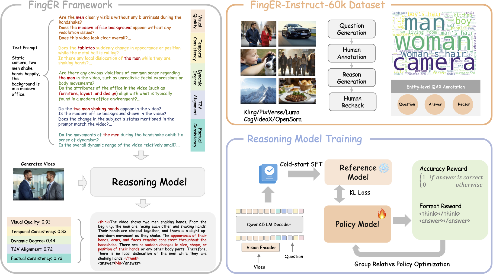
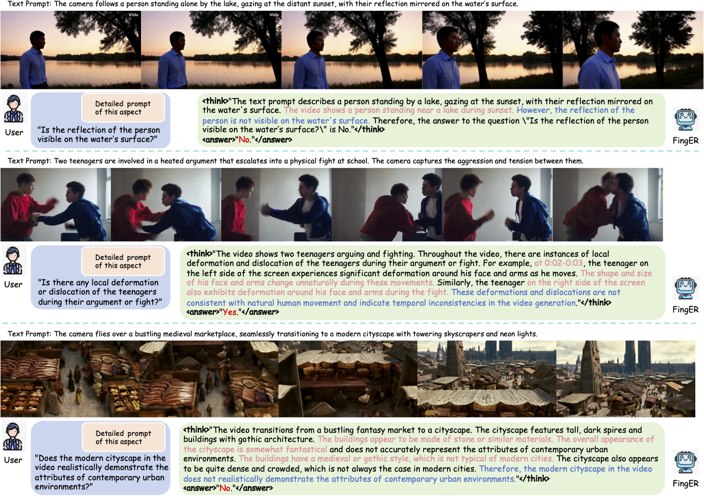

<div align="center">
<h1>[ACM MM 2025] FingER:
Content Aware Fine-grained Evaluation with Reasoning for AI-Generated Videos </h1>
<div align=center>

</div>
<br>
<a href='https://arxiv.org/abs/2504.10358'></a>
<br>
<div>
<a href="https://scholar.google.com/citations?hl=en&user=0_jpT2gAAAAJ&view_op=list_works&sortby=pubdate">Rui Chen</a>,
<a href="https://allylei.github.io/">Lei Sun</a>,
<a>Jing Tang</a>,
<a>Geng Li</a>,
<a href="https://cxxgtxy.github.io/">Xiangxiang Chu</a>,
</div>
<div>
    AMAP, Alibaba Group
</div>
</div>

## 🔥 Project Updates
- **News**: ```2025/07/17```: We plan to release ```FingER-60k``` recently. Stay tuned!

## 📈 Qualitative Results
<div align=center>

</div>

## 🌹 Acknowledgement
Our work is primarily based on [VideoGen-Eval](https://github.com/AILab-CVC/VideoGen-Eval), [VLM-R1](https://github.com/om-ai-lab/VLM-R1), [LLaMA-Factory](https://github.com/hiyouga/LLaMA-Factory). 
We are sincerely grateful for their excellent works.

## 📚 Citation
If you find our paper and code helpful for your research, please consider starring our repository ⭐ and citing our work ✏️.
```bibtex
@article{chen2025finger,
  title={FingER: Content Aware Fine-grained Evaluation with Reasoning for AI-Generated Videos},
  author={Chen, Rui and Sun, Lei and Tang, Jing and Li, Geng and Chu, Xiangxiang},
  journal={arXiv preprint arXiv:2504.10358},
  year={2025}
}
```
